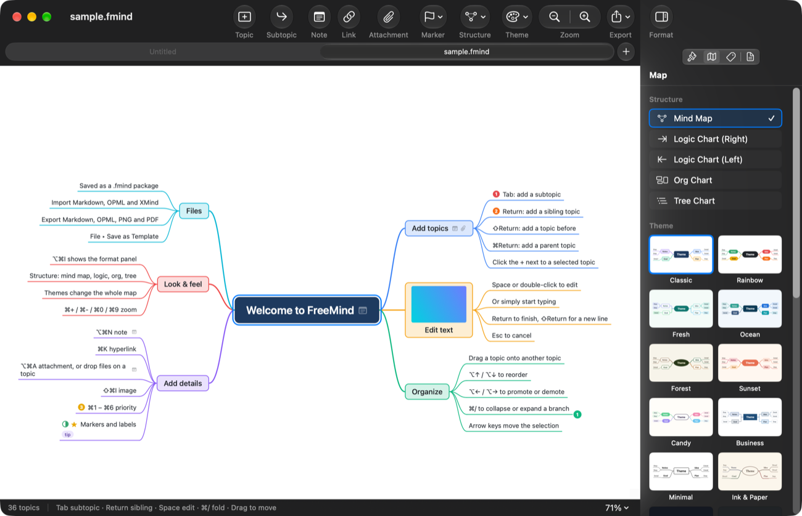
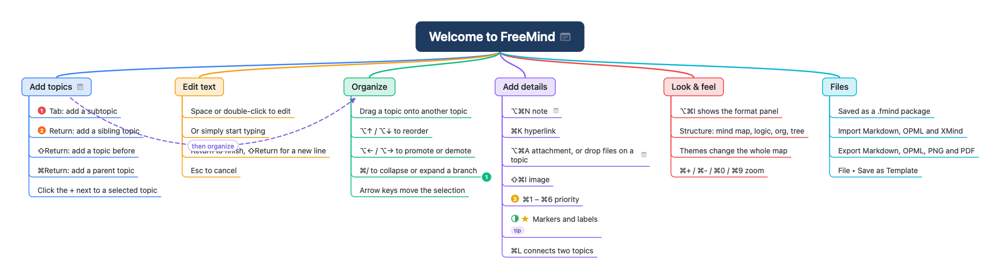
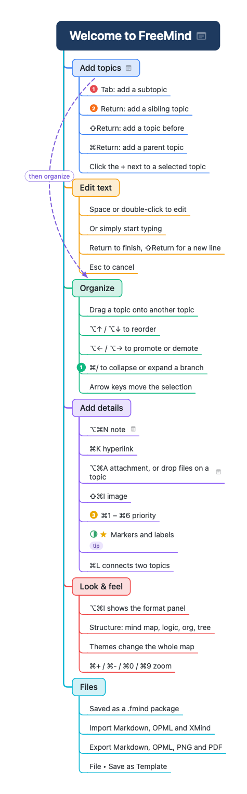
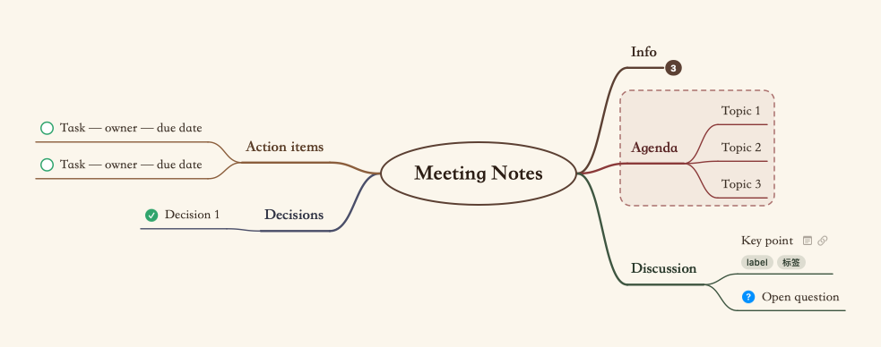
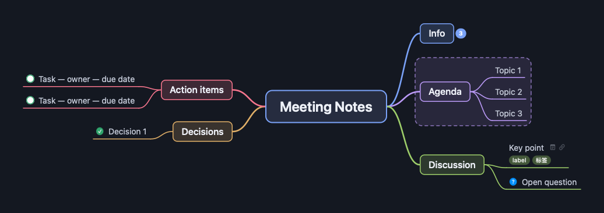

# FreeMind

macOS 原生的思维导图应用，操作方式参照 XMind，键盘就能完成大部分编辑。



## 功能

- **五种结构**：思维导图（左右平衡）、逻辑图（向右 / 向左）、组织结构图、树状图，随时切换
- **12 套内置风格**：经典、彩虹、清新、海洋、森林、日落、糖果、商务、极简、纸墨、午夜、石墨；可以调整背景、分支配色、字体、线宽后存为自定义风格
- **主题内容**：备注、超链接、附件、主题图片、标签、优先级 / 进度 / 旗帜 / 星星 / 符号标记、外框、联系线（带标签和可拖动的弧度）
- **单独样式**：形状（圆角矩形、矩形、胶囊、椭圆、菱形、下划线、无边框）、填充、边框、文字颜色、字号、粗体斜体、分支颜色，支持拷贝 / 粘贴样式
- **折叠状态随文件保存**，再次打开自动恢复；也会记住上次的缩放比例、位置和选中项
- **专属 `.fmind` 格式**：macOS 包格式，附件直接存在文件里，移动、分享不丢附件（[格式说明](docs/format.md)）
- **导入**：Markdown、OPML、XMind（新版和 XMind 8）、纯文本缩进大纲
- **导出**：Markdown（可连同附件导出到文件夹）、OPML、PNG、PDF，以及打印
- **模板**：新建时打开模板库，内置快速上手、项目计划、会议记录、SWOT、周计划、读书笔记、头脑风暴、决策分析、组织架构；任何导图都可以“存为模板”
- **查找**：⌘F 查找主题文字、标签和备注，自动展开被折叠的分支
- **原生体验**：自动保存、版本浏览、撤销 / 重做、窗口标签页、全屏、中文输入法行内组字、深色模式界面
- **Finder 集成**：Quick Look 扩展提供 .fmind 文件缩略图和空格预览（矢量 PDF）
- 中英文界面（跟随系统语言）

| 组织结构图 | 树状图 | 纸墨风格 | 午夜风格 |
|---|---|---|---|
|  |  |  |  |

## 常用操作

| 操作 | 快捷键 |
|---|---|
| 插入子主题 | Tab |
| 插入同级主题 | Return |
| 在前面插入主题 | ⇧Return |
| 插入父主题 | ⌘Return |
| 编辑文字 | 空格 / F2 / 双击，或选中后直接打字 |
| 编辑时换行 | ⇧Return |
| 删除主题 | ⌫（⌥⌫ 只删主题、保留子主题） |
| 移动选中项 | 方向键（加 ⇧ 扩展选择） |
| 调整顺序 / 升降级 | ⌥↑ ⌥↓ / ⌥← ⌥→ |
| 折叠 / 展开分支 | ⌘/（⌥⌘/ 全部展开，⌃⌘/ 全部折叠） |
| 移动主题 | 直接拖动（按住 ⌥ 拖动为复制） |
| 备注 / 超链接 / 附件 / 图片 / 标签 | ⌥⌘N / ⌘K / ⌥⌘A / ⇧⌘I / ⇧⌘L |
| 优先级 | ⌘1 … ⌘6 |
| 联系线 | ⌘L，再点目标主题（选中两个主题时直接连接） |
| 外框 | ⌥⌘B |
| 缩放 | ⌘+ ⌘- ⌘0，⌘9 缩放到合适大小，⌘ + 滚轮 |
| 格式面板 | ⌥⌘I |
| 平移画布 | 触控板滚动，或按住 ⌥ 拖动空白处 |

完整列表见菜单“帮助 ▸ 快捷键”。第一次启动会打开“快速上手”导图，以后可以从“帮助 ▸ 快速上手”再次打开。

## 构建

需要 Xcode 16 以上、[XcodeGen](https://github.com/yonaskolb/XcodeGen)。最低支持 macOS 14。

```sh
xcodegen                      # 由 project.yml 生成 FreeMind.xcodeproj
xcodebuild -project FreeMind.xcodeproj -scheme FreeMind -configuration Debug build
xcodebuild -project FreeMind.xcodeproj -scheme FreeMind test
```

其他脚本：

- `scripts/make-icon.sh`：把 `Sources/FreeMind/Resources/AppIcon.svg` 栅格化为应用图标（需要 `rsvg-convert`）
- `scripts/check-strings.sh`：检查所有界面文字是否都有中文翻译

## 项目结构

```
Sources/FreeMind/
├─ App/            启动、主菜单、文档控制器（新建走模板库、打开 Markdown/OPML/XMind 走导入）
├─ Model/          主题树、标记、联系线（值类型，撤销直接保存快照）
├─ Theme/          颜色描述、风格定义、内置风格、自定义风格库
├─ Layout/         样式解析、文字测量、五种结构的布局算法
├─ Canvas/         画布视图（绘制、选择、行内编辑、拖放、联系线交互）、渲染器、弹出编辑框
├─ Document/       NSDocument 子类、.fmind 包读写、附件存储、导出
├─ Editor/         编辑核心 MapEditor（所有修改与撤销）、窗口、工具栏、查找栏、状态栏
├─ Inspector/      右侧格式面板（样式 / 导图 / 标记 / 内容）
├─ ImportExport/   Markdown、OPML、XMind、图片导出
├─ Templates/      内置模板、用户模板、模板库窗口
├─ Settings/       偏好设置、设置窗口、快捷键窗口
└─ Resources/      Info.plist、图标、中英文本地化
Extensions/
├─ QuickLook/      空格预览扩展（数据型预览，输出 PDF）
├─ Thumbnail/      Finder 缩略图扩展
└─ Shared/         两个扩展共用的读取代码和沙盒 entitlements
```
