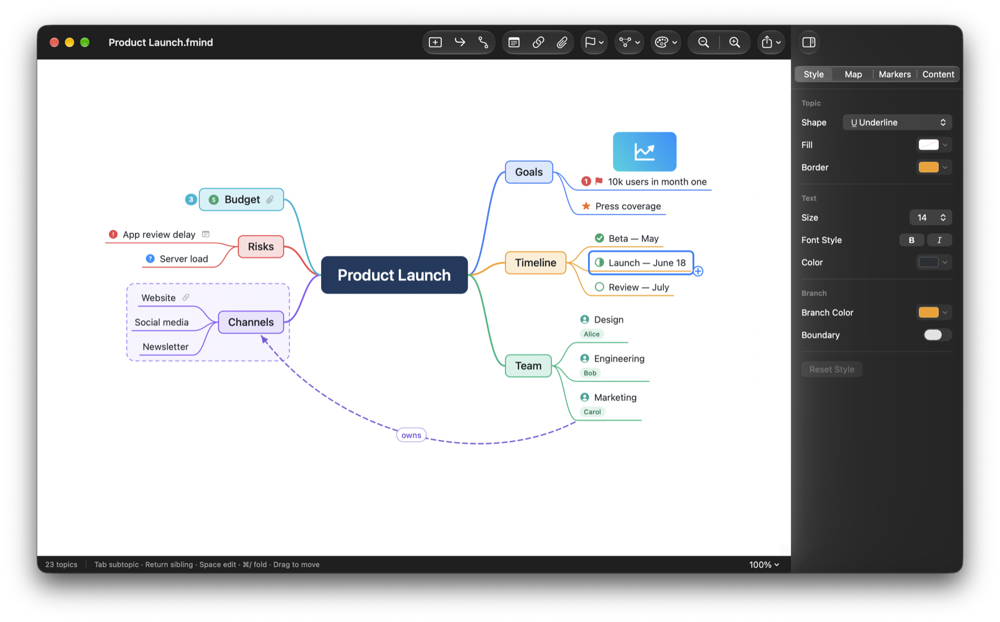
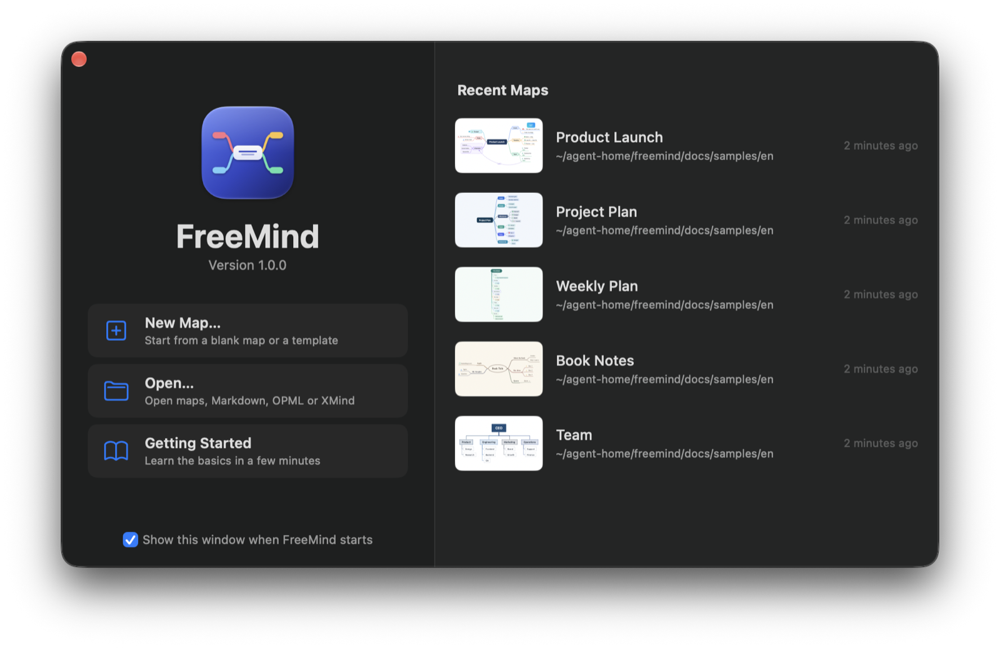
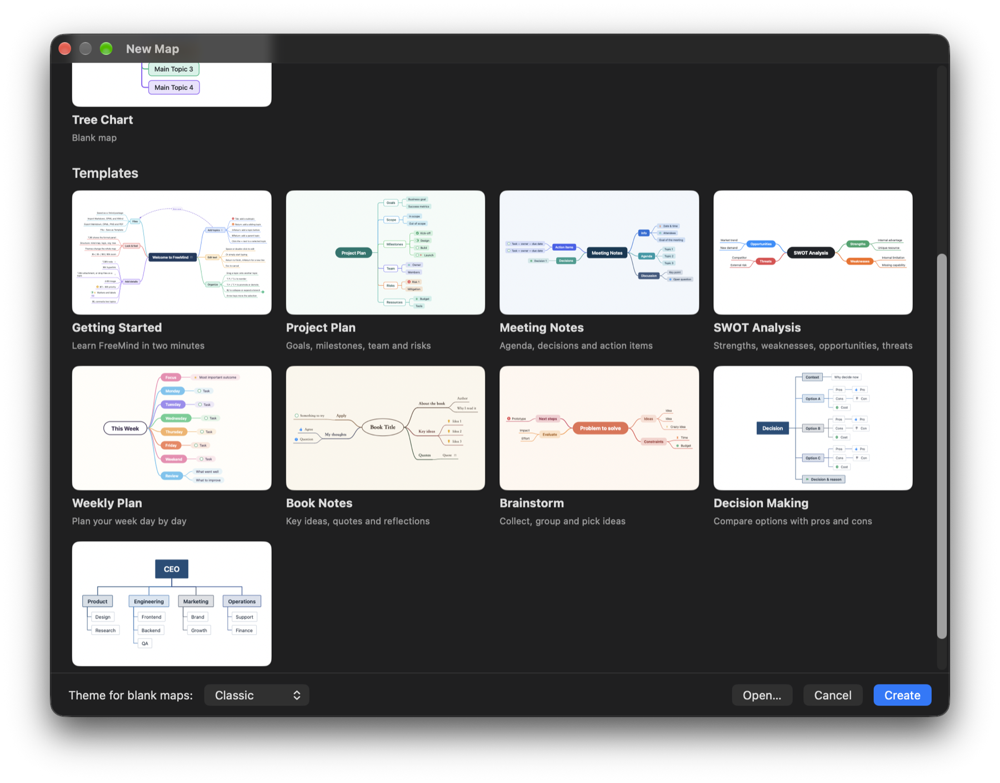
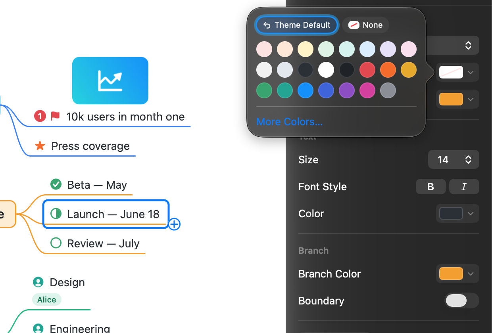
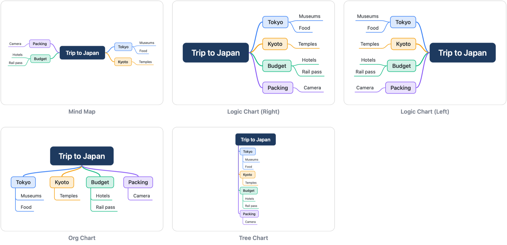
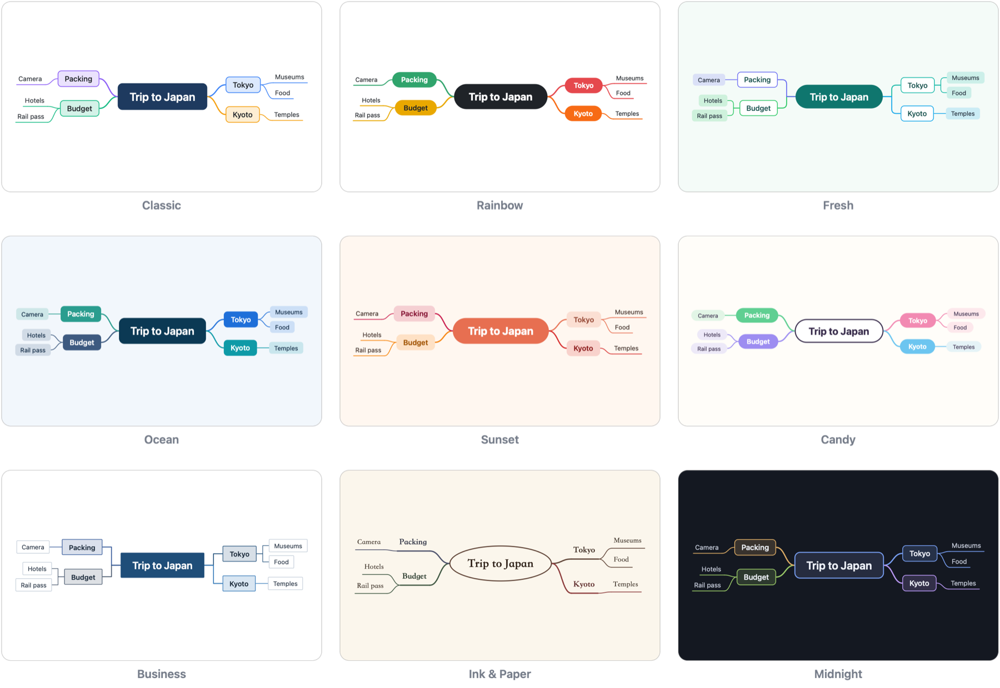

  

<h1 align="center">FreeMind</h1>

  macOS 原生的思维导图应用，操作方式参照 XMind，键盘就能完成大部分编辑。 
  <a href="README.md">English</a> · <b>简体中文</b>

## 特点

### AI Agent 可以直接编辑导图（MCP）

FreeMind 在本机提供 [MCP](https://modelcontextprotocol.io) 服务。Claude Code、Codex 等支持 MCP 的 AI Agent 接入后，
可以直接读取和修改你打开的导图：

- 读取整张导图或某个分支，查找主题，把导图画成图片查看效果
- 添加、修改、移动、删除主题，设置标记、标签、备注、联系线和格式
- 新建导图，打开或导入 Markdown / OPML / XMind 文件，保存导图

比如可以让 Agent“把这份会议记录整理成导图”，或者“给所有没完成的任务标上优先级”。
Agent 的每次修改都是一个撤销步骤，不满意按 ⌘Z 就能撤回。

接入方法：打开“设置 ▸ Agent”，点“拷贝命令”，在终端里运行一次，FreeMind 就加进了 Claude Code；
其他 Agent 用“拷贝 JSON”得到的配置。服务只接受这台 Mac 上的程序连接，每个请求都要带访问令牌；
关掉“允许 Agent 修改导图”后，Agent 只能读取。详见 [MCP 说明](docs/mcp.md)。

### 完全本地，没有云端

- 导图就是保存在你 Mac 上的 `.fmind` 文件。不需要注册帐号，没有服务器，FreeMind 不会把你的导图上传到任何地方
- 编辑、保存、导入、导出都不需要联网。FreeMind 唯一会主动联网的地方是每天检查一次 GitHub 上有没有新版本，
  可以在“设置 ▸ 通用”里关掉“自动检查更新”
- 接入 AI Agent 后，Agent 读到的导图内容会交给它所用的模型服务处理，这部分取决于你选用的 Agent

### 用 iCloud 云盘同步和备份

FreeMind 不自带同步服务。想在几台 Mac 之间同步，或者在云端留一份备份，
把导图保存到 iCloud 云盘即可（存储时在左侧边栏选“iCloud 云盘”）。`.fmind` 在 Finder 里是一个文件，附件也存在里面，同步和备份时会一起带上。

同一份导图不要在两台 Mac 上同时编辑；换到另一台 Mac 继续编辑前，先等 iCloud 同步完成。

## 下载

到 [Releases](https://github.com/xVanTuring/FreeMind/releases/latest) 页面下载最新版本的 `FreeMind-<版本>.dmg`，
打开后把 FreeMind 拖进“应用程序”文件夹。

- 需要 macOS 14 或更高版本
- App 已用 Developer ID 签名并经过 Apple 公证，可以直接打开
- 装好之后，有新版本时 App 会提示更新，不用再手动下载

## 功能

### 画导图

- **五种结构**：思维导图（左右平衡）、逻辑图（向右 / 向左）、组织结构图、树状图，随时切换
- **12 套内置风格**：经典、彩虹、清新、海洋、森林、日落、糖果、商务、极简、纸墨、午夜、石墨；背景、分支配色、字体、线宽都能调整，再存成自定义风格
- **主题内容**：备注、超链接、附件、主题图片、标签，优先级 / 进度 / 旗帜 / 星星 / 符号标记，外框，联系线（带文字标签，标签自动错开不重叠；直接拖动线或标签调整弧度，觉得干扰时可以全部隐藏）
- **单独设置样式**：形状（圆角矩形、矩形、胶囊、椭圆、菱形、下划线、无边框）、填充、边框、文字颜色、字号、粗体斜体、分支颜色，样式可以拷贝 / 粘贴
- **键盘操作**：Tab 加子主题、Return 加同级主题，选中后直接打字就能改文字，支持中文输入法行内组字
- **查找**：⌘F 查找主题文字、标签和备注，自动展开被折叠的分支

### 文件

- **专属 `.fmind` 格式**：macOS 包格式，附件直接存在文件里，移动、分享都不会丢附件（[格式说明](docs/format.md)）
- **折叠状态随文件保存**，再次打开自动恢复，也会记住上次的缩放比例、位置和选中的主题
- **导入**：Markdown、OPML、XMind（新版和 XMind 8）、纯文本缩进大纲
- **导出**：Markdown（可以连同附件一起导出到文件夹）、OPML、PNG、PDF，以及打印
- **Finder 集成**：Quick Look 扩展提供 `.fmind` 文件的缩略图和空格预览

### 使用体验

- **欢迎窗口**：启动时列出最近打开的导图（带缩略图），单击即可打开；右键 Dock 图标可以新建、打开
- **模板库**：新建（⌘N）时选择空白导图或模板，任何导图都可以“存为模板”
- **原生体验**：自动保存、版本浏览、撤销 / 重做、窗口标签页、全屏、深色模式
- **自动更新**：GitHub 上发布经过签名和公证的版本，App 每天自动检查新版本（FreeMind ▸ 检查更新…）
- 中英文界面，跟随系统语言

## 截图

### 欢迎窗口

启动时显示最近打开的导图，单击即可继续编辑。

### 模板库

内置快速上手、项目计划、会议记录、SWOT 分析、周计划、读书笔记、头脑风暴、决策分析、组织架构等模板。

### 格式面板

每项设置一行，颜色点开再选：风格默认色、预设色板，或者用系统颜色面板自由取色。

### 五种结构

### 内置风格（部分）

## 常用快捷键

| 操作 | 快捷键 |
|---|---|
| 插入子主题 | Tab |
| 插入同级主题 | Return |
| 在前面插入主题 | ⇧Return |
| 插入父主题 | ⌘Return |
| 编辑文字 | 空格 / F2 / 双击，或选中后直接打字 |
| 编辑时换行 | ⇧Return |
| 删除主题 | ⌫（⌥⌫ 只删主题、保留子主题） |
| 移动选中项 | 方向键（加 ⇧ 扩展选择） |
| 调整顺序 / 升降级 | ⌥↑ ⌥↓ / ⌥← ⌥→ |
| 折叠 / 展开分支 | ⌘/（⌥⌘/ 全部展开，⌃⌘/ 全部折叠） |
| 移动主题 | 直接拖动（按住 ⌥ 拖动为复制） |
| 备注 / 超链接 / 附件 / 图片 / 标签 | ⌥⌘N / ⌘K / ⌥⌘A / ⇧⌘I / ⇧⌘L |
| 优先级 | ⌘1 … ⌘6 |
| 联系线 | ⌘L，再点目标主题（选中两个主题时直接连接） |
| 显示 / 隐藏联系线 | ⌥⌘L |
| 外框 | ⌥⌘B |
| 缩放 | ⌘+ ⌘- ⌘0，⌘9 缩放到合适大小，⌘ + 滚轮 |
| 格式面板 | ⌥⌘I |
| 新建 / 打开 | ⌘N（打开模板库）/ ⌘O |
| 欢迎窗口（最近打开） | ⇧⌘1 |
| 平移画布 | 触控板滚动，或按住 ⌥ 拖动空白处 |

完整列表见菜单“帮助 ▸ 快捷键”。第一次启动会打开“快速上手”导图，以后可以从“帮助 ▸ 快速上手”再次打开。

## 示例导图

[`docs/samples/`](docs/samples) 里有几份示例导图（英文内容），上面的截图就是用它们拍的，可以直接用 FreeMind 打开。

## 开发

构建方法、脚本、相关文档和项目结构见 [Dev.md](Dev.md)。

## 许可协议

Copyright © 2026 xVanTuring

本程序是自由软件：你可以按照自由软件基金会发布的 GNU 通用公共许可协议（GPL）第 3 版，或（由你选择）任何更新的版本，
重新发布和修改它。

发布本程序是希望它有用，但不提供任何担保，也不包括对适销性或特定用途适用性的默示担保。详情见 GNU 通用公共许可协议。

协议全文见 [LICENSE](LICENSE)（SPDX：`GPL-3.0-or-later`）。
